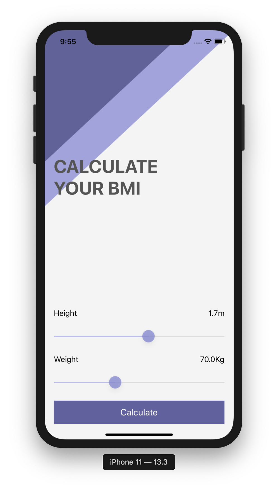
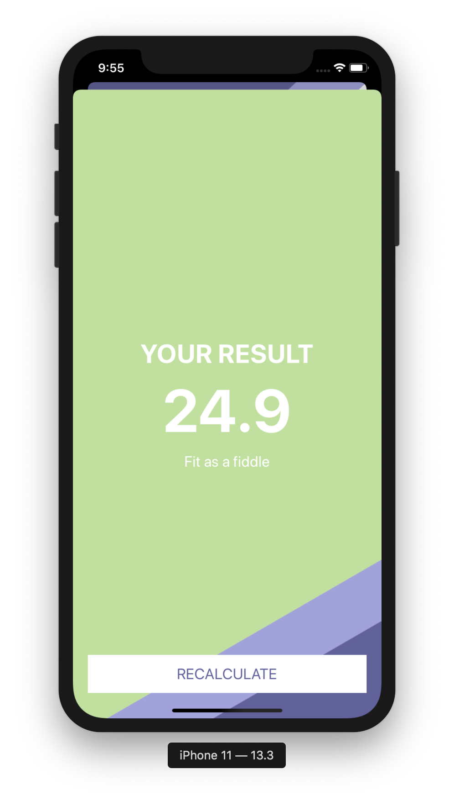

# CalcoloBMI
Body mass index (BMI) is a value derived from the mass (weight) and height of a person. The BMI is defined as the body mass divided by the square of the body height, and is universally expressed in units of kg/m2, resulting from mass in kilograms and height in metres.

A simple iOS App built on MVC Pattern

The app calculates Body mass index

● UISliders for Height and Weight
● UILabels for Height and Weight
● UIColors based on category
● MVC (Model View Controller)
● Segue presented Modally
● Background image
● Stack View and Constraints

 
